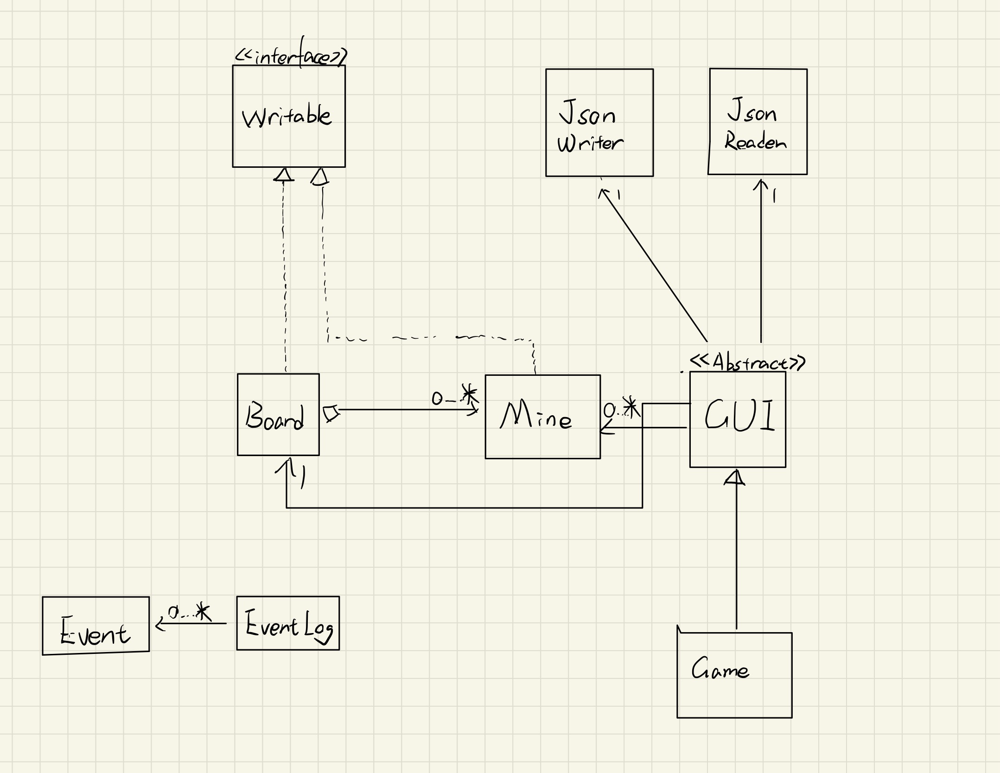

# My Personal Project

## A Story About Mineweeper Game

I used a computer for the first time when I was 3 years old. The first time I used a computer, I was fascinated by this huge machine that I operated with a mouse and keyboard. I didn't know many words or how to manipulate applications to accomplish tasks such as writing documents, searching for information on the Internet, or sending messages to others on Facebook. Still, as a kid, graphics appealed to me at the time. Through self-discovery, I found *Sipider Solitaire* and *Mineweeper* from the WinXP startup menu. and although I played both, Mineweeper's beautiful colorful graphics and fun gameplay appealed to me the most among all games I found. Now that I'm older, and windows has been updated from XP all the way to Win 11, I can still feel the fond memories of playing Mineweeper. I've noticed that fewer and fewer people play Mineweeper these days due to its outdated game desigs. **Therefore, as a second year computer science student, I would like to generate a new version of Mineweeper to commemorate my childhood and bringing more people back to this game again.**

The game I designed is suitable for all computer users, especially gamers and those people with nostalgia for the old days. This game replicates the original gameplay of dragging and dropping cards to a fixed position and using card sorting to win. In addition to this game there will be some new features such as music and other additional gameplay.

## User Stories
- As a user, I want games add multiple **mines** to a the **game board**.

- As a user, I wish the game list all the **mines** in my **game board** in two dimensions.

- As a user, I wish I can self customize the game about the size of the board and the number of bomb.

- As a user, I wish I can cick the cell through input x and y coordinates.

- As a user, when I select the quit option from the application menu, I want to be reminded to save my to-do list to file and have the option to do so or not.

- As a user, when I start the application, I want to be given the option to load my to-do list from file.

## Instructions for Grader

A list of step-by-step instructions for interacting with your GUI that describes:

How to generate the first of the two required actions that are related to the required user story "add multiple Xs to a Y" (e.g., click the button  labelled "Add an X", or select the menu item labelled "Add an X", or type <ctrl>+N on the keyboard to add an X,...)
- In the main manue, user can choose add arbitrarily number of cells and setting up bombs by enter the number on keyboard to the GameBoard.

how to generate the second of the two required actions

- When user plays the game, everytime when they click a cell on gameboard , it will shows\ the number of bomb surrounded and update the score of the gameboard.

where to find the visual component that was added to your project (e.g., background image, image added to button)
- when click the start game there is a start opening
- when click the bomb there is a visual image
- when win the game there is an image for celerbrate

how does the user save the state of the application to file
- The load button on the main manue

how does the user load the state of the application from file
- The save button on the gameboard

## Phase 4: Task 2 
generate a game board for adding number of cells to gameboard
- Thu Aug 08 01:50:05 PDT 2024
- Added 25 cells into the board

Assiged the Bomb 
- Thu Aug 08 01:50:05 PDT 2024
- Set this cell as Bomb: model.Mine@68ed4772 in the board

Increase the number of Bomb near by of cell 
- Thu Aug 08 01:50:05 PDT 2024
- Detected one Bomb near by increase the number of bomb near by for all the cell - aroung the this bomb

Action when user click the cell to update the score on board 
- Thu Aug 08 01:57:48 PDT 2024
- Update the score

Action when user load the game
- Thu Aug 08 01:48:18 PDT 2024
- Load the data to Game

Action when user save the game
- Thu Aug 08 01:48:22 PDT 2024
- Save the data to Json

## Phase 4 Task 3

